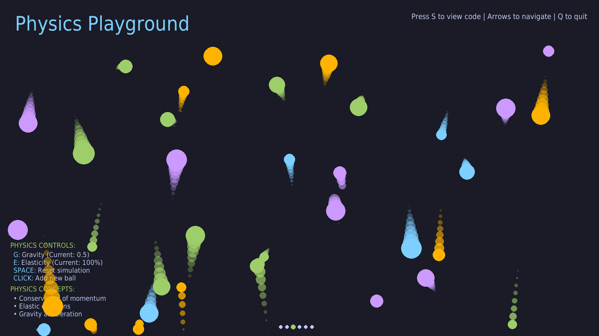

# 🎮 Pygame Tutor

[](https://www.gnu.org/licenses/gpl-3.0)

**An interactive playground for learning Python through Pygame.**
Designed for learners and educators, this project features modular,
visual lessons that teach core programming concepts through hands-on fun.



---

## ✨ Features

- **Interactive Lessons**:
  - 🚀 Comet animation with trails
  - ⚛️ Physics: gravity + bouncing balls
  - ⌨️ Key input visualizer
  - 🧱 Breakout and Arkanoid clones

- **Learning-Oriented Tools**:
  - 📜 Toggleable real-time code viewer (`S`)
  - 💡 In-lesson explanations
  - ↔️ Navigation between lessons

- **Built for Devs**:
  - 🧩 Modular architecture (`pygametutor/`)
  - 🎨 Color-themed rendering
  - 📐 Auto-scaling screen support

---

## 🚀 Installation

Install via `uv` or regular `pip`:

```bash
uv tool install pygame-tutor
# or
uv pip install pygame-tutor
# or
pip install pygame-tutor
````

Run with:

```bash
pygame-tutor
```

---

## 🕹️ Controls

* `← →`: Navigate between lessons
* `S`: Toggle code viewer
* `Q` / `ESC`: Quit
* Lesson-specific controls are displayed in each lesson.

---

## 📚 Lessons

| Lesson                 | Description                   | Concepts                          |
| ---------------------- | ----------------------------- | --------------------------------- |
| **Cosmic Comet**       | Rainbow comet trail animation | Animation loop, trails, movement  |
| **Physics Playground** | Gravity + collisions          | Physics, collisions, vector math  |
| **Key Detection Lab**  | Input visualizer              | Events, key handling, rendering   |
| **Breakout Game**      | Brick-breaking with paddle    | State, collisions, win/loss logic |

---

## 🧑‍💻 Create a Lesson

To add your own:

1. Inside `pygametutor/lessons/`, create a file:

   ```bash
   lesson_06_myfeature.py
   ```

2. Add your class:

```python
from pygametutor.core.base import BaseLesson

class Lesson06Myfeature(BaseLesson):
    def __init__(self, screen_geo):
        super().__init__(screen_geo)
        self.title = "My New Lesson"

    def update(self, dt):
        pass  # Update state

    def draw(self):
        pass  # Draw everything

    def handle_events(self, event):
        pass  # React to input
```

3. It will be loaded automatically at startup.

---

## 🎨 Color Palette

Based on the Tokyo Night theme:

```python
{
    "background": (26, 27, 38),
    "text": (169, 177, 214),
    "highlight": (122, 162, 247),
    "accent": (158, 206, 106),
    "Orange": (255, 179, 0),
    "Purple": (204, 153, 255)
}
```

---

## 🧩 Project Structure

```
pygametutor/
├── core/         # Engine components
├── lessons/      # Each lesson = one file
├── settings/     # Constants & paths
└── main.py       # Entry point (called by CLI)
```

---

## 🛠 For Developers

* 🐍 Python 3.8+
* 📦 Dependencies managed via `uv` or `pip`
* 🧪 Test locally:

  ```bash
  uv pip install -e .
  pygame-tutor
  ```

---

## 📜 License

Licensed under the GNU General Public License v3.0.
See [LICENSE](LICENSE) for details.

> *"Learn by doing"* — Pygame Tutor turns code into creativity.

---
